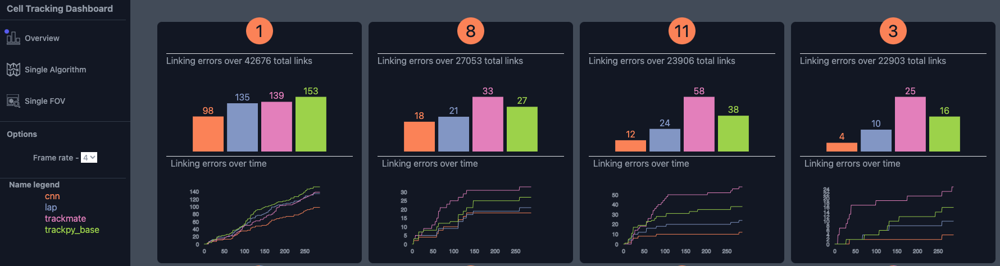

## CellTrackVis

Interactive Visualization of cell tracking algorithms performance

---

### Interactive example

An example of CellTrackVis can be found [here](https://iuricichf.github.io/CellTrackVis/)
To run the example locally you can simply download this repository and run a local server on your machine.

### User Guide

#### Input format
---

Inputs consist of two data types, images and CSV files containing the tracking algorithms' results.

Images are contained in folder `src/`. Each folder contains the sequence of images, in `*.jpg` format, composing a specific field of view.

CSV fiels are contained in the folder `src/results`. Each folder contains the results collected with a specific algorith. Inside that folder you can find one CSV file per field of view. For each file, lines indicate information associated to a cell. For each line we have

- `FRAME`: The frame index, starting from 0.
- `ID`: The cell index.
- `track_id_unique`: the index of the ground truth track.
- `track_id_parent`: the index of the ground truth parent track. If `track_id_unique` is different than.`track_id_parent` it means that the cell belongs to a new track originated after a cell divided in two.
- `pos_x`: X coordinate of the cell nuclues center.
- `pos_y`: Y coordinate of the cell nuclues center.
- `dtk_n0_dx`: ground truth displace of the cell nucleus along the X axis afer `k` frames
- `dtk_n0_dy`: : ground truth displace of the cell nucleus along the Y axis afer `k` frames 
- `track_id_unique_pred`: track index as predicted by a cell tracking algorithm.
- `track_id_parent_pred`: parent track index.

#### Updating the input
---

Regardless of the files ontained in the `src\` the standalone version of CellTrackViz in this repository allows to edit the field of view and algorithms considered at loading time.

The list of algorithms to consider can be modified by updating [this list](https://github.com/IuricichF/CellTrackVis/blob/d28582f8253923f88ea8958931283c711f4e9f8e/index_initialization.js#L1).

The list of field of views can be modified by updating [this list](https://github.com/IuricichF/CellTrackVis/blob/d28582f8253923f88ea8958931283c711f4e9f8e/index_initialization.js#L2).
